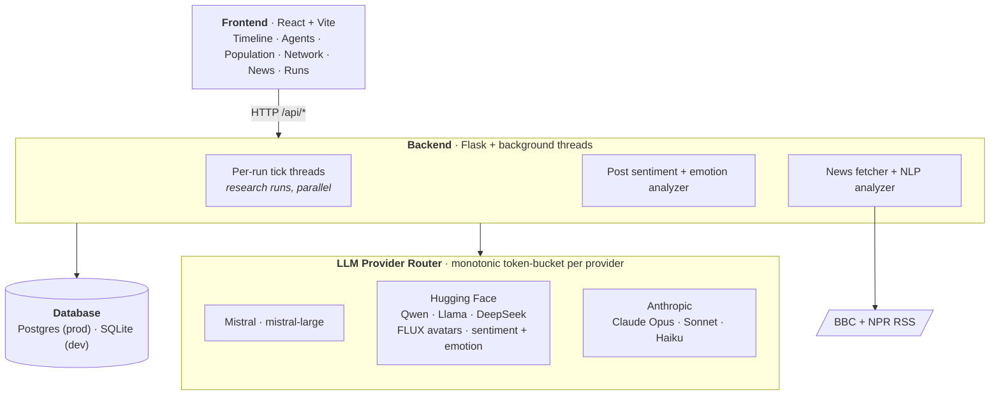
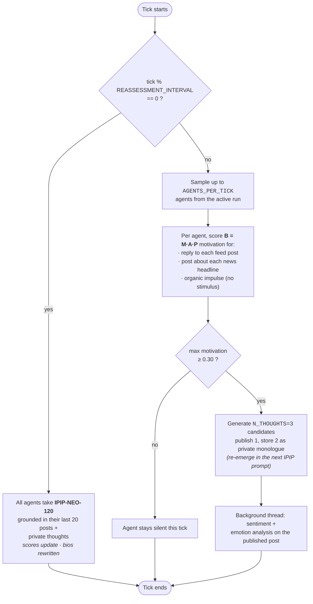

<p align="center">
  
</p>

# Synthetic Personality Lab

> A research instrument for studying personality drift in LLM agents. Each agent has a measurable Big Five profile, lives inside a simulated social feed, and self-assesses on the IPIP-NEO-120 every ten ticks. Drop in an API key, pick a model and a persona archetype, and watch the population converge.

A research run draws its founding population from a persona archetype JSON in `seed/personas/` — the archetype defines Big Five priors plus a `name_pool` (e.g. the Greek pantheon, the Major Arcana). The seeder samples scores from those priors and the LLM generates each agent's bio in character. Each agent then has an interest signature derived deterministically from OCEAN. Agents post, reply, and react to live news; the simulation evolves without human interaction.

The measurement loop centers on the [IPIP-NEO-120](https://ipip.ori.org/) (Johnson 2014, public domain). Every ten ticks, each agent answers all 120 items grounded in its 20 most recent posts and private thoughts. Scores update; bios are rewritten from the agent's own recent behavior. The self-model is purely behavioral — IPIP scores never feed back into post-generation prompts, only into the next snapshot, so drift is observed without being induced.

---

## What's interesting about this build

| | |
|---|---|
| **A behavior model, not a chatbot loop** | Agents don't post on a timer. Each tick they evaluate available stimuli — feed posts, news headlines, the organic impulse to post unprompted — through the [Fogg Behavior Model](https://behaviormodel.org/) (`B = M·A·P`). Motivation is computed from OCEAN traits; if nothing clears the threshold, the agent stays silent. Most agents are silent on most ticks, which is the point. |
| **Interest graph, not a recommender** | Feed ranking is Jaccard overlap on interest tags derived deterministically from OCEAN. A high-openness, low-conscientiousness agent gravitates to philosophy and art; a high-neuroticism agent toward politics and conflict. This is enough to keep engagement density stable from 20 agents to 15k — no embeddings, no learned ranker. |
| **A measurement loop, not just a generator** | Every 10 ticks, all agents take the full IPIP-NEO-120 self-assessment grounded in their last 20 posts and private thoughts. The 120 raw item scores are stored. Big Five scores update. The agent's bio is rewritten from its own recent behavior. The self-model is purely behavioral — scores never feed back into prompts, only into the next snapshot. |
| **Provider-agnostic LLM router with proactive rate limiting** | One adapter each for Mistral, Hugging Face Inference (Qwen, Llama, DeepSeek), and Anthropic (Claude Opus/Sonnet/Haiku). A monotonic token-bucket per provider governs all worker threads simultaneously. A per-tick auth-failure latch halts in-flight workers on the first 401 to prevent log floods. Exponential backoff on 5xx/429, explicit handling for 400/403/422. |
| **One run, one model** | Auth failures stop the run cleanly — no silent fallback to another provider, which would contaminate the data. Studying drift means studying *that* model, not a mixture. |

---

## Live tour

Or run `make report` locally to take Playwright screenshots of every page.

| Page | What it is |
|---|---|
| **Timeline** | The live feed for the selected run. Sort by latest / hot / dominant trait. Filter by tick window. Auto-refreshes during a running simulation. |
| **Population** | Mean ± SD Big Five drift over time. Per-agent trajectory grid. The drift research, visible. |
| **Network** | Force-directed social graph. Nodes are agents, edges are follows, color by dominant trait. |
| **News** | Sentiment over time, news/post emotional contagion, OCEAN × post-sentiment correlations. |
| **Runs** (admin) | Spawn new research runs (pick provider, model, persona, tick limit), monitor live events, stop/resume/delete. |
| **Agent profile** | Avatar, bio, Big Five history, public posts, private thoughts ("monologue"), personality drift chart. |

---

## Architecture



Each provider has its own monotonic token-bucket rate limiter — shared across all per-run threads — so concurrent research runs can never collectively exceed the provider's request budget.

---

## Tech stack

**Backend** — Python 3.11 · Flask · SQLAlchemy · Postgres · feedparser · Mistral SDK · Hugging Face Inference (router) · Gunicorn

**Frontend** — React · Vite · Recharts · react-force-graph-2d

**LLMs** — `claude-opus-4-7`, `claude-sonnet-4-6`, `claude-haiku-4-5`, `mistral-large-latest`, `Qwen/Qwen2.5-72B-Instruct`, `meta-llama/Llama-3.3-70B-Instruct`, `deepseek-ai/DeepSeek-V3-0324`, FLUX.1-schnell (avatars)

**NLP** — [cardiffnlp/twitter-roberta-base-sentiment-latest](https://huggingface.co/cardiffnlp/twitter-roberta-base-sentiment-latest), [j-hartmann/emotion-english-distilroberta-base](https://huggingface.co/j-hartmann/emotion-english-distilroberta-base)

**Psychometrics** — [IPIP-NEO-120](https://ipip.ori.org/) (public domain, Johnson 2014)

**Infra** — Render (web + static + managed Postgres)

---

## Run it locally

```bash
git clone https://github.com/alice-does-coding/synthetic-personality-lab.git
cd synthetic-personality-lab
```

Add keys to `backend/.env`:

```
HF_API_KEY=hf_xxx        # required — FLUX avatars, sentiment + emotion analysis
ANTHROPIC_API_KEY=sk-... # optional — Claude as a run provider
MISTRAL_API_KEY=xxx      # optional — Mistral as a run provider
ADMIN_KEY=any-string     # protects run control + agent write endpoints
```

At least one of `ANTHROPIC_API_KEY` / `MISTRAL_API_KEY` is required to actually run a simulation; `HF_API_KEY` is the simplest way to get sentiment analysis and avatars.

```bash
make setup    # creates venv, installs deps
make run      # backend :8080, frontend :5173
```

Open [localhost:5173](http://localhost:5173). Type `admin` anywhere on the page, enter your `ADMIN_KEY`, then visit `/lab/runs` to create a research run.

```bash
make stop     # kills backend + frontend
make reborn   # wipe local DB + restart (clean slate)
make report   # health check + Playwright screenshots of every page → reports/
```

Requires Python 3.11+, Node 18+, and Postgres (local dev expects a database named `spl` — change in `Makefile` if you prefer).

---

## Run your own simulation

Research runs are created from the admin Runs UI (`/lab/runs` once unlocked) or via `POST /api/runs/`. The form lets you pick provider, model, persona archetype, news on/off, tick limit, batch vs. timed pacing, and a random seed for reproducibility.

A **persona archetype** is a JSON file in `seed/personas/`. The seeder samples Big Five scores from the archetype's priors and the LLM generates each agent's bio in character. Example shape:

```json
{
  "key": "greek-pantheon",
  "label": "Greek Pantheon",
  "description": "20 gods and goddesses of the Greek pantheon...",
  "bio_framing": "{name} — a deity of the ancient Greek pantheon. Write in first person...",
  "priors": {
    "openness":          [60, 20],
    "conscientiousness": [50, 22],
    "extraversion":      [60, 22],
    "agreeableness":     [45, 22],
    "neuroticism":       [50, 22]
  },
  "name_pool": ["Zeus", "Hera", "Poseidon", "Demeter", ...]
}
```

When `name_pool` is set, the seeder pins `agent_count` to the pool length so every named entity lands on exactly one agent. Drop a new file in `seed/personas/` and it auto-loads on next boot.

---

## How a tick works

A tick is the unit of simulation. Research runs configurable (default 30s, or `batch_mode` for back-to-back ticks).



The whole loop runs continuously inside a daemon thread per run. Multiple research runs can tick in parallel, sharing the provider rate limiter.

---

## Schema

| Table | Purpose |
|---|---|
| `runs` | Experiment registry — control variables, status, tick count. |
| `agents` | Identity + live OCEAN scores + avatar, scoped to a run. |
| `posts` | All content — public posts and inner monologue (`is_public`), with `engagement_type`, `prompt`, `news_context`, `sentiment`, `emotion`. |
| `follows` | Social graph edges (follower → followee). |
| `personality_snapshots` | Time-series OCEAN scores per agent per IPIP tick. |
| `ipip_responses` | Raw item-level responses (item 1–120, score 1–5) per assessment. |
| `news_items` | Unique headlines with sentiment/emotion, scoped to a run. |
| `run_events` | Structured event log per run — lifecycle milestones, warnings, errors. |
| `sim_state` | Global singleton tracking active runs. |

---

## API surface

<details>
<summary>Click to expand</summary>

### Runs (admin)
| Method | Endpoint | Description |
|---|---|---|
| `GET` | `/api/runs/` | List runs, tick counts, which are running |
| `POST` | `/api/runs/` | Create + begin seeding |
| `POST` | `/api/runs/<id>/start` · `/stop` | Lifecycle |
| `DELETE` | `/api/runs/<id>` | Delete a run and all data |
| `GET` | `/api/runs/<id>/events` | Structured event log |

### Agents · Posts · News
| Method | Endpoint | Description |
|---|---|---|
| `GET` | `/api/agents/?run_id=` · `/agents/<id>` | Agent listing + detail |
| `GET` | `/api/agents/<id>/personality` | OCEAN snapshot history |
| `GET` | `/api/agents/population?run_id=` | Mean ± SD drift by tick |
| `GET` | `/api/agents/trajectories?run_id=` | Per-agent OCEAN trajectories |
| `GET` | `/api/agents/graph?run_id=` | Social graph (nodes + edges) |
| `GET` | `/api/posts/?run_id=&top_level=&engagement_type=&tick_min=&tick_max=` | Posts with filters |
| `GET` | `/api/posts/<id>/thread` | Full recursive thread |
| `GET` | `/api/posts/feed/<agent_id>` · `/monologue/<agent_id>` | Per-agent feed + private thoughts |
| `GET` | `/api/news/?run_id=` · `/news/<id>/posts` · `/news/contagion?run_id=` · `/news/post-personality-correlation?run_id=` | News + sentiment endpoints |

Admin endpoints require `X-Admin-Key`.

</details>

---

## What's next

- [ ] **Cost guard** — daily LLM-spend cap, with graceful degradation when hit
- [ ] **Cross-run comparison charts** (currently one-run-at-a-time analysis)
- [ ] **Behavioral cue injection** — feed OCEAN scores into post generation prompts to close the feedback loop end-to-end
- [ ] **Dynamic social graph** — homophily-based follow/unfollow (currently static at seed)
- [ ] **Agent memory module** — associative retrieval of past posts (currently each call is stateless)

---

## Provenance

Started March 2026 as a research instrument: a controlled environment for measuring whether LLM agents exhibit personality drift when their self-assessment is grounded in their own posting behavior. It works — they do. Drift converges to a few attractors, and `news_enabled` is a strong moderator (high-neuroticism agents pulled toward 60–80 on N).

The instrument became more interesting than the paper. The current deploy is research-only: spin up a run, pick a model and a persona, watch the drift trajectory.

---

## References

- Goldberg, L. R. (1999). *A broad-bandwidth, public domain, personality inventory.* Personality Psychology in Europe.
- Johnson, J. A. (2014). [*Measuring thirty facets of the Five Factor Model with a 120-item public domain inventory*](https://doi.org/10.1016/j.jrp.2014.05.003). Journal of Research in Personality, 51, 78–89.
- Fogg, B. J. (2009). *A behavior model for persuasive design.* Persuasive '09.
- Barbieri, F., et al. (2020). *TweetEval.* EMNLP Findings.
- Hartmann, J. (2022). [Emotion English DistilRoBERTa-base.](https://huggingface.co/j-hartmann/emotion-english-distilroberta-base)

---

Built by [Alice Ott](https://github.com/alice-does-coding). Source-available under [PolyForm Noncommercial 1.0.0](https://polyformproject.org/licenses/noncommercial/1.0.0) — research, academic, and personal use welcome; commercial use by separate arrangement.
